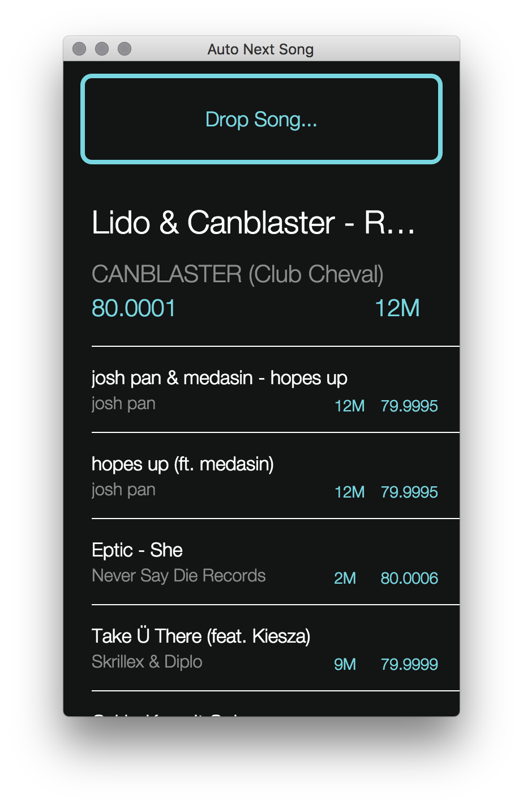
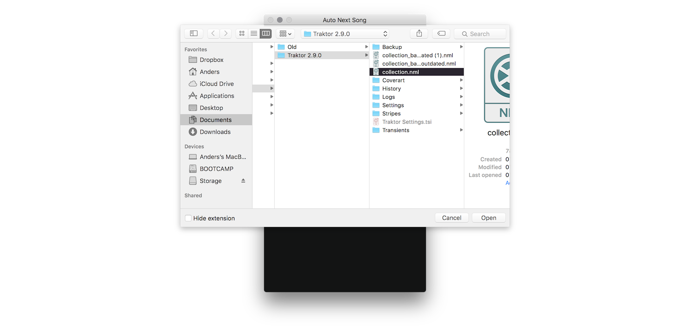
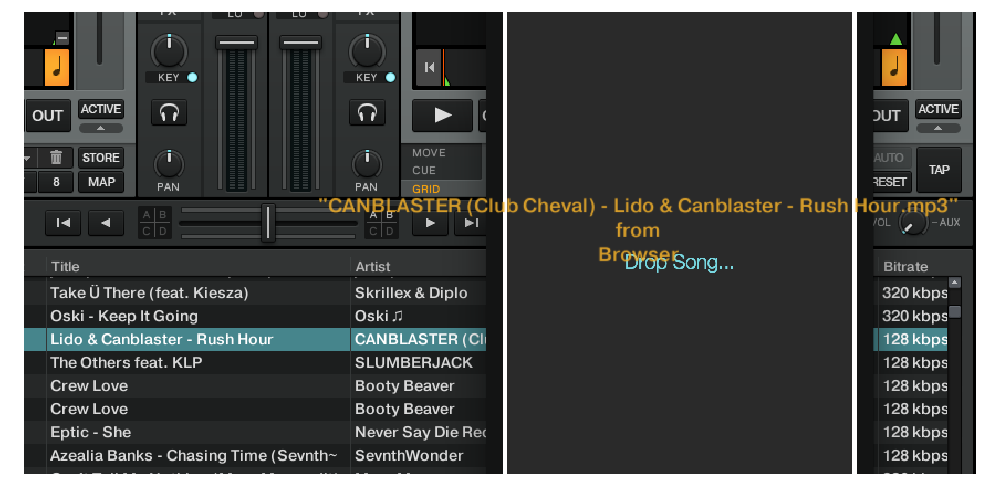

# TraktorAutoNextSong
A small tool for automatically finding the next song to play when DJing using Traktor Pro 2.

The tool works by creating a weighted graph of every song in a Traktor collection of songs, where the weights determine what song is best to mix into. 
The weight is calculated using the BPM of the songs and their different keys. 

The tool is written in F# and Node.js/Electron. The backend is written in F#, and acts as a small web server receiving graph/song requests. 
The frontend is written in Node.js/Electron and sends requests to the F# web server.

When a song is dropped into the app, the best transitions from that song are displayed. 
The DJ can then pick a song from the list in Traktor Pro 2. The app merely functions as a suggestion list.

On Mac the app requires Mono to run (download [here](http://www.mono-project.com/docs/getting-started/install/mac/)).

On Windows the app requires .NET to run (download [here](https://www.microsoft.com/en-us/download/details.aspx?id=30653)).

#### [Download](https://github.com/andersfischernielsen/TraktorAutoNextSong/releases/latest)

 

## How to Use
- Open the app and click the button to find your Traktor collection. 
- Browse to the location of your collection.nml file.  
- Let the app analyse the collection.
- Drag a file from the song list in Traktor into the app to get a list of possible transitions from the song.  

## Building
The app consists of a F# backend handling parsing the Traktor 2 collection, and serving results via HTTP and JSON to the Electron frontend. 

Running the app requires having Mono installed on your system.

You can build the app by opening the solution by running

    cd TraktorAutoNextSong
    xbuild /p:Configuration=Release Project/TraktorAutoNextSong.sln

in your Terminal.

## Running
The F# backend is started by running 

    cd TraktorAutoNextSong
    mono Project/Traktor/bin/Release/Traktor.exe

in your Terminal. 

The frontend is started by running

    cd TraktorAutoNextSong
    electron/node_modules/electron-prebuilt/dist/Electron.app/Contents/MacOS/Electron electron

in your Terminal.

