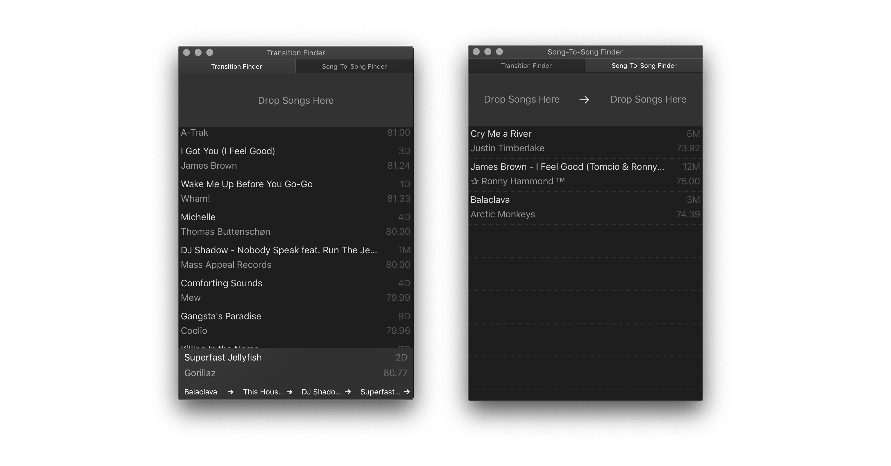

 

When a song is dropped into the app the best transitions from that song are displayed based on BPM and the keys of songs. 
The DJ can then pick a song from the list in Traktor. 

Two songs can also be dropped into the app in order to find the shortest path between two songs, allowing a DJ to quickly transition between two desired songs. 

The tool creates a weighted digraph of every song in a Traktor collection of songs, where the weights determine what song is best to mix into from the current song. The weight is calculated using the BPM of the songs and their different keys. 
The app is implemented in Swift, available for macOS. 

<a href="https://github.com/andersfischernielsen/Traktor-Transition-Finder/releases/latest">Download</a>

## How to Use
- Open the app and select `File` -> `Open Collection...` and select your Traktor collection. 
- Let the app analyse the collection and the available transitions.
- Drag a file from the song list in Traktor or from Finder into the app to get a list of possible transitions from the song.
- Double-click transitions in the transition list to explore continuous transitions.
- Double-click transition in the transition history to jump back to a previous song.
